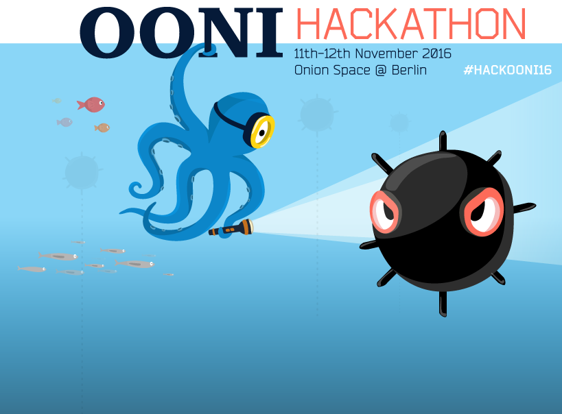

# OONI Hackathon 2016

Interested in exploring (and exposing) internet censorship? Join the Open
Observatory of Network Interference (OONI) hackathon in Berlin!

**When?**
Friday, 11th November & Saturday, 12th November 2016

**Where?**
The OnionSpace (Gottschedstraße 4, 13357 Berlin, Germany)

**What time?**
10 AM onwards

On this page you can see some of the projects that you could pick up to hack
on, but feel free to pick also something else!

# Projects

## Add support for testing reachability of Tor bridges

Speak to: @hellais

Difficulty: easy-medium

Technologies: python

Tor bridges are used by people to circumvent censorship in places where tor is
blocked. Currently there are tests as part of ooniprobe that support testing
tor bridges, but they are not run automatically.

As a first step in doing this it would be neat to just extend the current tor
test deck to also test for reachability of some set of Tor bridges (using the
ooniprobe `tcp_connect` test) see:
[ooni-probe/652](https://github.com/TheTorProject/ooni-probe/issues/652)

## Integrate tor related date into tor metrics

Speak to: karsten, @hellais

Difficulty: easy-medium

Technologies: java, R/ggplot2, postgres

Some data that is being collected by OONI is related to the tor network and it
would be useful to have it integrated inside of [tor
metrics](https://metrics.torproject.org).
In particular it would be useful to export all `vanilla_tor` test results in a
way that is ingestible by tor metrics or write a layer of integration of it
inside of the metrics data pipeline.

Other interesting sources of data would be the `bridge_reachability` and
`web_connectivity` tests (`https://www.torproject.org/`).

See: [ooni-pipeline/13](https://github.com/TheTorProject/ooni-pipeline/issues/13)

## Extract blockpages from the data

Speak to: @darkk
Difficulty: easy-medium

There is hypothesis that blockpages may be extracted from the OONI database in
semi-automated way using some basic ML (machine learning) and/or NLP (natural
language processing) techniques independent from the language used for the
blockpage.

## Implement header-field-manipulation for measurement-kit

Speak to: @bassosimone, @hellais

Difficulty: easy-medium

The repository to work on is [measurement-kit/measurement-kit](https://github.com/measurement-kit/measurement-kit)
that contains a C++ implementation of OONI tests currently used on mobile.

The reference specification of the header-field-manipulation test is available
in the [repository describing OONI specifications](https://github.com/TheTorProject/ooni-spec/blob/d37d22983d766f67ccd528fe50a30773782073c3/test-specs/ts-006-header-field-manipulation.md).

A similar, already-implemented test is [http-invalid-request-line](https://github.com/measurement-kit/measurement-kit/blob/31391f5ab6c12d87f2b73c17ec30cf23832bb059/test/ooni/http_invalid_request_line.cpp).

## Add OONI bouncer API support to measurement-kit

Speak to: @bassosimone, @hellais

Difficulty: easy-medium

The repository to work on is [measurement-kit/measurement-kit](https://github.com/measurement-kit/measurement-kit)
that contains a C++ implementation of OONI tests currently used on mobile.

The specification of the bouncer API is available in the
[repository describing OONI specifications](https://github.com/TheTorProject/ooni-spec/blob/7ecb43072ef1022fd5e715c7bcd33ea804eee77d/oonib.md#40-bouncer).

A similar, already implemented functionality is [the collector client](https://github.com/measurement-kit/measurement-kit/blob/31391f5ab6c12d87f2b73c17ec30cf23832bb059/src/libmeasurement_kit/ooni/collector_client.cpp)

# Useful information

There is a local copy of all the OONI reports in case you want to download them
and use them during the hackathon.
It can be accessed via following means:

- HTTP — http://oonicdn.fritz.box
- FTP — ftp://oonicdn.fritz.box
- Rsync — `rsync oonicdn.fritz.box::oonicdn`
